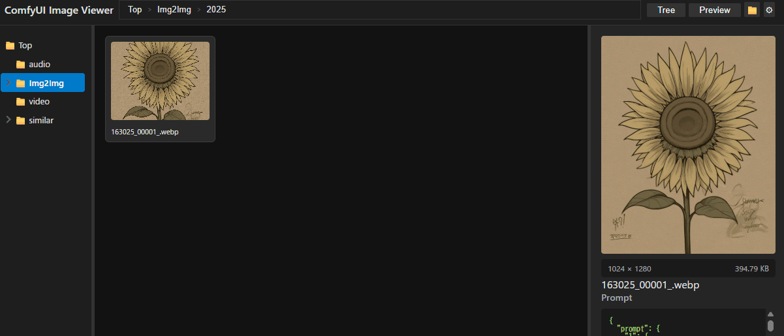

# ComfyUI用 ImageViewer

ブラウザのみで動作する、ComfyUI ユーザー向けの画像ビューアです。

Python で作成していたアプリをベースに「PWAでどこまで実現できるか」をテーマに開発しました。

※ File System Access API を使用しているため、**Chrome 系のブラウザ（Google Chrome, Edge 等）のみ対応**しています。

🚀 **デモ・アプリはこちら:** [https://gearsns.github.io/comfyUIImageViewer/](https://gearsns.github.io/comfyUIImageViewer/)

---

## 🌟 主な特徴

* **Windows エクスプローラー風の操作感:** 直感的にローカル画像をブラウジング
* **完全ローカル・ブラウザ動作:** サーバーへ画像をアップロードせずに安全に利用可能
* **ComfyUI メタデータ表示:** 生成時に埋め込まれたタグやパラメーターを表示
* **AI による類似画像の自動グループ化:** 増えがちな生成画像を賢く整理
* **プロンプト検索:** ワークフローやプロンプトのテキストから画像を検索

---

## 🛠️ 技術スタック・実装ポイント

* **File System Access API:** ローカルフォルダ内のファイルをブラウザから直接参照・操作
* **メタデータ解析:** PNG / WebP に埋め込まれた Workflow や Prompt 情報を自動抽出
* **Service Worker による仮想フォルダ:** ローカルファイルの画像表示を最適化
* **Web Worker + AI:** 複数スレッド処理による類似画像のバックグラウンドグループ化
* **GitHub Actions:** メインブランチへのプッシュで自動デプロイ
* **AI アシスト開発:** コード生成AIを活用して効率的に構築
